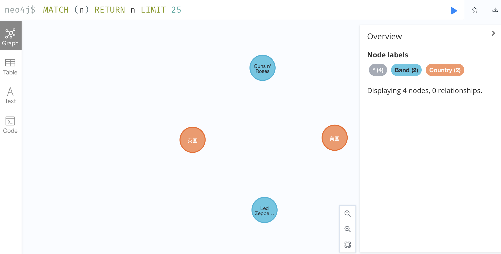
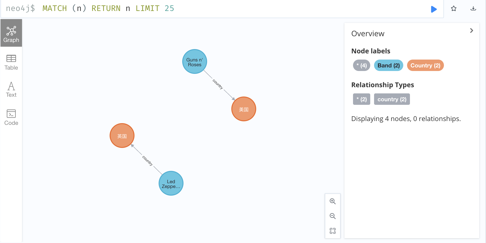

neo4j 学习笔记

# 初步学习 增删改查

创建节点
```sql
CREATE (n:Band {name:'Guns n\' Roses'}) RETURN n
CREATE (n:Band {name:'Led Zeppelin'}) RETURN n
CREATE (a:Country{name:'英国'}) RETURN a
CREATE (a:Country{name:'美国'}) RETURN a
```
查看节点
```sql
MATCH (n) RETURN n LIMIT 25
```

创建关系
```sql
MATCH (a:Band),(b:Country) WHERE a.name = "Guns n' Roses" AND b.name = "美国" CREATE (a)-[:country]->(b)
MATCH (a:Band),(b:Country) WHERE a.name = "Led Zeppelin" AND b.name = "英国" CREATE (a)-[:country]->(b)
```
> web提示：This query builds a cartesian product between disconnected patterns.
> 也就是说如果有m个a和n个b，则会这个建立连接的次数为m*n次，但是在这种情况下我们还是可以这样使用的，毕竟m和n是可控的。

查看节点
```sql
MATCH (n) RETURN n LIMIT 25
```
