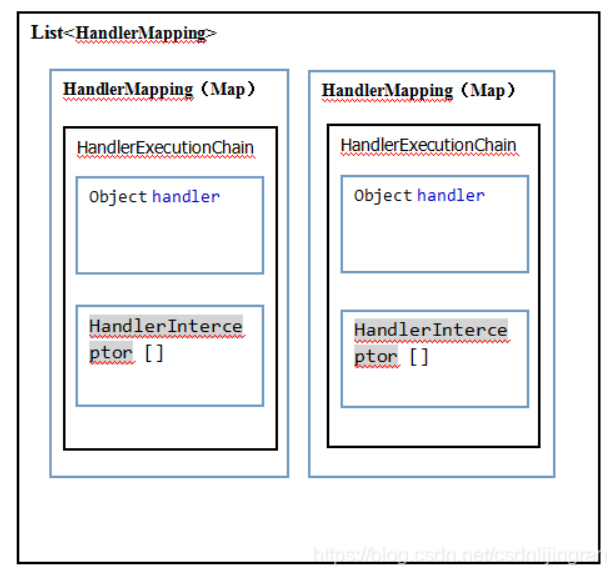
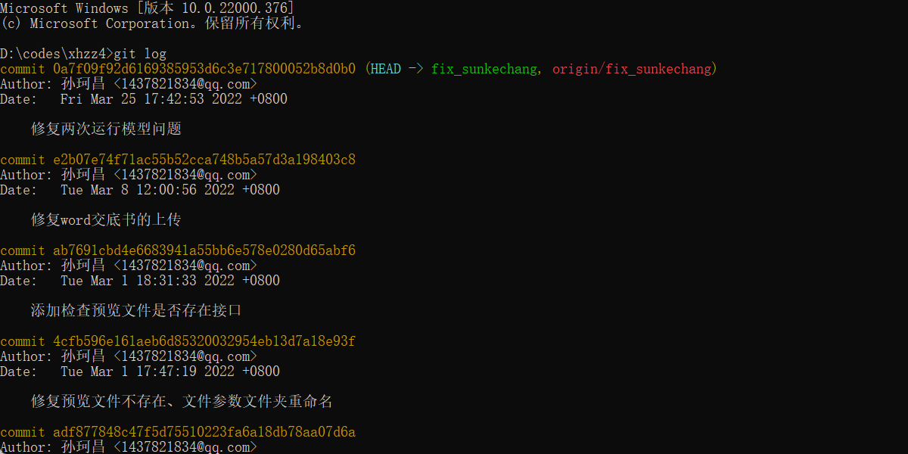

# 面试学习

待解决问题：
linux查询日志命令
## Java

### JMM

#### 什么是JMM内存模型？

java内存模型就是在底层处理器内存模型的基础上，定义自己的多线程语义。它明确指定了一组排序规则，来保证线程之间的可见性。

这一组规则被称为Happens-Before，JMM规定，要想保证B操作看到A操作的结果，那么A和B必须满足Happens-Before关系：

单线程规则

监视器锁定规则

volatile变量规则：对volatile字段的写入动作happens-before后续对这个字段的每个读取动作

线程start规则

线程join规则

传递性

#### 什么情况会发生栈内存溢出？

1、栈是线程私有的，栈的生命周期和线程一样，每个方法在执行的时候就会创建一个栈帧，它包含局部变量表、操作数栈、动态链接、方法出口等信息。局部变量表又包含基本数据类型和对象的引用。

2、当线程请求的栈深度超过了虚拟机允许的最大深度时，会抛出StackOverFlowError异常，方法递归调用可能会出现该问题。


### JVM

#### 垃圾回收

##### 如何判断一个对象是否存活？

1. 引用计数法

   给每一个对象设置一个引用计数器，当有地方引用该对象时就加一，引用失效时减一。当引用计数器为0时说明该对象没有被引用，也就是垃圾对象，等待回收。

   **缺点**：无法解决循环引用的问题

2. 可达性分析法

   从一个被称为GC Roots的对象向下搜索，如果一个对象到GC Roots没有任何引用链相连接时，说明该对象不可用，在java中可以作为GC Roots对象的有以下几种：

   - 虚拟机栈中引用的对象
   - 方法区类静态属性引用的变量
   - 方法区常量池引用的对象
   - 本地方法栈JNI引用的对象

   当一个对象满足以上条件时，不会马上被回收，还需要进行两次标记。第一次：判断当前对象是否有finalize方法并且还方法没有被执行过，若不存在则标记为垃圾对象。若有，则进行第二次标记。第二次标记将当前对象放入F-Queue队列，并生成一个finalize线程去执行该方法，虚拟机不保证该方法一定会被执行，这是因为如果线程执行缓慢或进入了死锁，会导致回收系统崩溃；如果执行了finalize方法后仍没有与GC Roots对象有直接或间接引用，则被回收。

##### 被引用的对象就一定能存活吗？

不一定。看引用类型，弱引用在GC时会被回收，软引用在内存不足时，即OOM前会被回收。但如果没有在Reference Chain中的对象一定会被回收。

##### 几种垃圾回收算法的比较？

| 回收算法类型                优点                             | 缺点                                         |                  | 适用区域 |
| ------------------------------------------------------------ | -------------------------------------------- | ---------------- | -------- |
| 标记清除算法     不需要移动对象，简单                       高效 | 标记、清除过程效率低，产生内存碎片           |                  | 老年代   |
| 标记复制算法 清理速度快，无内存碎片                          | 内存使用率低                                 |                  | 年轻代   |
| 标记整理                                                     | 简单高效                                     | 仍需移动局部对象 | 老年代   |
| 分代收集                                                     | 集合前三种方法，实行新生代与老年代的分区方法 |                  |          |


##### 有哪几种垃圾回收器？各自的优缺点？

| 垃圾回收器类型    | 使用的回收方法 | 特点                                                         | 设置参数 | 使用区域       |
| ----------------- | -------------- | ------------------------------------------------------------ | -------- | -------------- |
| Serial            | 复制           | 单线程回收器，简单高效，停顿时间长，一般只用于客户端         |          | 年轻代         |
| ParNew            | 复制           | 多线程回收器，降低停顿时间，但增加线程上下文切换消耗         |          | 年轻代         |
| Parallel Scavenge | 复制           | 多线程回收器，追求高吞吐量，高效利用CPU，可控制最大垃圾回收停顿时间 |          | 年轻代         |
| Serial Old        | 标记-整理      | 单线程回收器，简单高效，停顿时间长。主要用于客户端。         |          | 老年代         |
| Parallel Old      | 标记-整理      | 多线程回收器，追求高吞吐量                                   |          | 老年代         |
| CMS               | 标记-清除      | 并发回收器，可与用户线程同时运行，高并发，低停顿，CPU占用比较高，响应时间快，停顿时间短，需要Serial Old 来避免并发失败的风险 |          | 老年代         |
| G1                | 标记整理+复制  | 并发回收器，可与用户线程同时运行，基于Region的内存布局形式，高并发， 低停顿，可控的回收停顿时间 |          | 老年代，年轻代 |

CPU飙高，负载均衡策略

JVM调优命令？

- jps: JVM Process Status Tool, 显示指定系统内所有的HotSpot虚拟机进程。
- jstat(JVM statistics Monitoring): 用于监视虚拟机运行时状态信息。可以显示虚拟机进程中的类装载、内存、垃圾收集、JIT编译等运行数据。
- jmap(JVM Memory Map): 生成heap dump文件。
- jstack: 生成java虚拟机当前时刻的线程快照。可以查看各个线程的调用堆栈，可以知道相应的线程在后台做什么事。
- 

CMS（Concurrent Mark Sweep）回收过程？CMS问题？

1. 

- 初始标记（STW）：主要搜寻标记GC Root直接关联的下级对象。
- 并发标记：根据上一步结果，继续向下标识所有关联的对象，知道这条链走到尽头。
- 重新标记（STW， CPU停顿比初始标记稍微长，远比并发标记短）：标记与第二步同时进行的线程所产生的垃圾。
- 并发清除：清理删除阶段标记死亡的对象。

2. 问题：
   1) 并发回收导致CPU资源紧张。
   2) 无法清理浮动垃圾（无法清除并发清除阶段产生的垃圾）
   3) 并发失败（并发操作时留给程序的内存无法满足系对象的需要，会并发失败）
   4) 内存碎片（标记清除算法，可以通过规定整理的参数来决定来一次内存整理）

G1回收过程？

- 初始标记（STW）：标记与GC Root直接关联的对象。并且修改TAMS指针的值，让下一阶段用户线程并发操作时，能正确在可用的Region中分配新对象。
- 并发标记：通过可达性分析，找出要回收的对象。
- 最终标记（STW）：处理并发阶段结束后仍有引用变动的对象。
- 清理阶段（STW）：根据用户所期望的停顿时间制定回收计划，可以自由选择任意多个Region构成回收集，然后把决定回收的那部分Region的存活对象复制到空的Region中，再清理掉旧Region的全部空间。这里涉及到存活对象的移动，所以需要暂停用户线程。

G1与CMS stop the world的区别

CMS的初始标记和重新标记都会STW，他的初始标记较短，重新标记较长。

G1在初始标记、最终标记、清理阶段都会STW。两者都以降低停顿时间为目标，但是区别是G1可以根据时间预测模型来预测清理时间，可以在用户规定的停顿时间内完成垃圾回收，所以更加高级可靠。

#### OOM排查

除程序计数器，其他内存区域都有OOM的风险。

- 栈会发生StackOverflowError，比如32位系统单线程限制2G内存，无线创建线程会发生栈的OOM
- Java8常量池移到堆上，溢出会发生java.lang.OutOfMemoryError:Java heap space，设置最大原空间大小参数无效。
- 方法区OOM，经常会遇到的是动态生成大量的类、jsp。
- 直接内存OOM，涉及到-XX:MaxDirectMemorySize参数和Unsafe对象对内存的申请。

排查方法：

- 增加两个参数- XX：+HeapDumpOnOutOfMemoryError -XX:HeapDumpPath=/tmp/heapdump.hprof，当OOM发生时自动dump堆内存信息到指定目录
- 同时jstat查看监控JVM的内存和GC情况，先观察问题大概出在什么区域
- 使用MAT工具载入到dump文件，分析大对象的占用情况，比如HashMap做缓存未清理，时间长了就会内存溢出，可以把它改为弱引用。

#### JVM调优命令？

- jps：JVM Process Status Tool，显示指定系统内所有的HotSpot虚拟机进程
- jstat：JVM statistics Monitoring，用于监视虚拟机运行时状态信息的命令。可以显示虚拟机进程中的类装载、内存、垃圾收集、JIT编译等运行信息
- jmap：JVM Moemory Map，用于生成headp dumo文件。
- jhat：JVM Heap Analysis Tool，与jmap命令搭配使用。
- jstack：生成java虚拟机当前时刻的线程快照。

#### 强引用、软引用？

- 强引用，普通的对象引用关系，如String s = new String("1");
- 软引用，用于维护一些可有可无的对象。只有在内存不足时，系统则会回收软引用对象，如果回收了软引用对象之后仍然没有足够的内存，才会抛出**内存溢出**异常。
- 弱引用，拥有更短的生命周期。当JVM进行垃圾回收时，无论内存是否充足，都会回收被弱引用关联的对象
- 虚引用是一种形同虚设的引用。

#### Java里将对象设置为null，是否会被立刻回收？

一个对象置为null，并不会被立刻回收，还需要进行finalize()方法。但是只能逃脱一次。

#### 内存泄漏、内存溢出？

内存溢出：程序需要申请新的内存时，没有足够大小的内存空间供其使用。

1、java.lang.OutOfMemoryError: Java heap space堆内存溢出

2、java.lang.StackOverflowError栈溢出

3、java.lang.OutOfMemoryError: PermGen space

内存泄漏：程序申请内存后，当不再使用时，本该被回收却始终无法释放。（本质长生命周期对象持有短周期对象，导致短周期对象无法被回收。）

1、**静态集合类。**如HashMap、LinkedList。如果这些容器是静态的，那么他们的生命周期与程序一致，则容器中的对象在程序结束之前将不能被释放，从而造成内存泄漏。

2、**各种链接、如数据库连接、网络连接等。**当不再使用是，需要调用close方法来释放与数据库的连接。

3、**变量不合理的作用域。**未及时把对象设置为null

4、**内部类持有外部类。**外部类返回了一个内部类，即使外部类不再被使用，也不会被回收。

### 基础

#### 线程与进程与协程？

- 调度：进程是资源管理的基本单位，线程是程序执行的基本单位
- 切换：线程上下文切换比进程上下文切换要快得多
- 地址空间：每个进程都自己的独立地址空间，各个进程之间互不影响。但某个线程的非法操作会使整个进程终止。
> 进程：系统资源调度的基本单位
> 线程：任务调度和系统执行的基本单位
> 协程：一种用户态的轻量级线程，协程的调度完全由用户控制。拥有自己的寄存器上下文和栈

#### 深拷贝浅拷贝

共同点：都是对基础类型数据的值进行拷贝

区别：

深拷贝对引用对象的值进行拷贝，然后赋值给一个新的对象。

浅拷贝只返回对象的引用地址。

Object.clone():

这个函数会返回一个新的对象，对于基础数据类型会对值进行拷贝，对于引用数据会视情况（如果该引用类型编写了自己的clone函数，并且是可以深拷贝的，那么就是深拷贝）。

所以Object.clone()既可以完成深拷贝，也可以完成浅拷贝。

https://www.html.cn/qa/other/22850.html

#### Java泛型

**以下这个写法报错吗？**

```java
List list = new LinkedList();
list.add("11");
list.add(1);
```

答：不报错

类型擦除（泛型擦除）：使用泛型时加上的类型参数，在编译时去掉类型参数。

#### 使用泛型的好处？

1. 类型安全
   - 主要目标是提高Java程序的类型安全
   - 编译时期就可以检查出因Java类型不正确导致的ClassCastException异常
   - 符合越早出错代价越小原则

2. 消除强制类型转换
3. 潜在的性能收益
   - 所有工作都在编译器中完成
   - 编译器生成的代码跟不适用泛型时所写代码几乎一致。

#### 类加载

什么是双亲委派模型？为什么需要双亲委派模型？

当一个类加载器收到一个类加载的请求，他首先不会尝试自己去加载，而是将这个请求委派给父类加载器去加载，只有父类加载器在自己的范围内查找不到这个类时，才放心交给子加载器去加载。

如何打破双亲委派模型？

自定义类加载器，集成ClassLoader类，重写loadClass方法和findClass方法。

#### BIO、NIO、AIO区别

- BIO：同步并阻塞，在服务器中实现的模式为一个连接一个线程。如果这个连接不做任何事情会造成不必要的线程开销，当然这也可以通过线程池机制改善。BIO一般适用于连接数目小且固定的架构。
- NIO：同步并非阻塞，服务器上是一个请求一个线程。一般适用于连接数目多且连接比较短的架构，并发局限于应用中，编程比较复杂。
- AIO：异步并非阻塞，一个有效请求一个线程。一般适用于连接数目多且连接比较长的架构，充分调用操作系统参与并发操作，编程比较复杂，从JDK1.7开始支持。

#### Java IO都有哪些设计模式？

- 适配器模式。把一个类的接口变换成客户端所期待的另一种接口，**从而使原本因接口不匹配而无法在一起工作的两个类能够在一起工作**。	
  - 类适配器，继承Adaptee类（原角色），实现Target接口（目标角色）
  - 对象适配器，持有Adaptee类对象实例，实现Target接口（目标角色）

  如InputStreamReader继承自Reader同时持有InputStream的实例StreamDecoder，这样使得两个接口可以工作。
  
- 装饰器模式。

  ```java
  new BufferedInputStream(new FileInputStream(inputStream));
  ```

  一种动态地往一个类中**添加新的行为（使得其功能更加强大）**得设计模式。就功能而言，装饰器模式相比生成子类更为灵活，这样可以**给某个对象而不是整个类添加一些功能**。

  如BufferedInputStream继承自FilterInputStream同时持有InputStream的实例。实现了能将数据存储到缓存中的强大功能。

两者区别是一个动态一个静态。

#### 设计模式？

工厂模式：定义一个创建对象的接口，让其子类自己决定实例化哪一个工厂类，工厂模式使其创建过程延迟到子类进行。
- 工厂方法模式：最开始，小米和华为都只生产手机，小米和华为都是手机公司这一抽象工厂的实现类，想要拿到小米手机，只需要call小米的getPhone()函数，新增一个品牌也只需要加一个文件。
- 抽象工厂：后来小米、华为都生产路由器，那么你既可以买手机也可以买路由器。也就是可以买不同类别的产品了。
- 优点：用户不需要知道产品的名字，只需要知道抽象产品的名字和工厂的名字，以后生产过程发生变化你也不用管，只需要修改工厂文件，降低了耦合性。
- 缺点：当新增一个产品时还是需要改变所有工厂。

单例模式：该类负责创建自己的对象，同时确保只有单个对象被创建，这个类提供了一种访问其唯一对象的方法，可以直接访问，不需要实例化该类的对象。**保证一个类只有一个示例，并提供访问它的全局访问点。**

适配器模式

装饰器模式

以下代码展示了饱汉、饿汉的单例模式

```java
import java.util.Scanner;

class BHan {
    private static BHan instance = new BHan();

    private BHan (){};
    public static BHan getInstance() {
        return instance;
    }
}

class EHan {
    private static EHan instance;

    private EHan (){};
    public static EHan getInstance() {
        if(instance == null) {
            instance = new EHan();
        }
        return instance;
    }
}

class DoubleCheck {
    private static DoubleCheck doubleCheck;
    private DoubleCheck() {};
    public static DoubleCheck getInstance() {
        if(doubleCheck == null) {
            synchronized (DoubleCheck.class) {
                if(doubleCheck == null) {
                    doubleCheck = new DoubleCheck();
                }
            }
        }
        return doubleCheck;
    }
}
public class Doing {
    public static void main(String[] args) {
       BHan bHan = BHan.getInstance();

    }
}
```


#### 多态实现原理？

在JVM的方法区中维护了类的基本信息，其中每个类都有一个放发表，里面存放了指向对应方法的指针，当需要调用方法时，只要去方法表里找到对应的指针，就可以找到对应的方法。


**多态使用前提：**

```java
List<Integer> xx = new ArrayList<>();
```

而不是

```java
ArrayList<Integer> xx = new ArrayList<>();
```

也就是说声明变量的类型是父类。

**实现原理：**

- 多态分为编译时多态、运行时多态
  - 编译时多态：重载（名称相同，输入参数||返回值不同），这个只需在编译时通过静态绑定就能实现。
  - 运行时多态：重写（重写父类方法），这就需要用子类方法的指针替换方法表里父类对应方法项的指针。

**用途：**

提高对设计和架构的复用。如不再使用ArrayList后，可以用LinkedList直接代替他。减少了代码的修改。

**补充：**

多态的另一种实现方式（实现接口）更为复杂。因为Java的单继承保证了类的线性关系，而接口可以同时实现多个。所以JVM中，多态的实例方法调用实际上有两种指令。

- invokevirtual指令用于调用声明为类的方法
- invokeinterface指令用于调用声明为接口的方法

当使用invokeinterface时就只能挨个找了。

### 集合

#### HashMap ConcurrentHashMap

HashMap:阈值=容量*负载因子

##### **为什么ConcurrentHashMap线程安全：**

jdk1.7中使用的Segment锁（继承自ReentrantLock），它可以锁住一段区域。

jdk1.8中改为synchronized。

  在put时对这个节点sychronized加锁，保证安全
  （**CAS**用于当该处没有Node时创建一个Node，expected=null, newVal = new Node，**synchronized**用于给这个Node节点加锁，然后完成put操作）。

##### **HashTable底层结构？**

Entry数组+链表。
不会再形成红黑树。
他的put方法为synchronized修饰，所以是线程安全的。
由于他的put，get均为方法加锁，所以效率上不如ConcurrentHashMap。

##### 两者共同构造：

HashMap：数组+链表+红黑树

ConcurrentHashMap：
- jdk1.7：Segment（继承ReenTrantLock）+HashEntry
- jdk1.8:synchronized+CAS+HashEntry+红黑树（**CAS**用于当该处没有Node时创建一个Node，expected=null, newVal = new Node，**synchronized**用于给这个Node节点加锁，然后完成put操作）

**疑问：HashEntry是单链表类似的结构，如何通过计算hash值直接找到地址的？**答：是使用的HashEntry数组

#### HashMap的put方法流程？

1、根据key值计算hash值，找到该元素在数组中存储的下标

2、如果数组是空的，则调用resize进行初始化

3、如果没有hash冲突，直接放入对应的下标中

4、如果有冲突，并且key值已经存在，则直接覆盖

5、如果有冲突，且该节点是红黑树，则将该节点挂在该树上

6、如果冲突后是链表。

if(链表长度大于8且数组容量小于64) {

​	扩容

}

if(链表长度大于8且数组容量大于64) {

​	结构转为红黑树

}

else {

​	插入键值对。

}


#### HashMap扩容方式？

HashMap在容量超过负载因子所定义的容量之后，就会扩容。将HashMap的大小扩大为原来数组的两倍，并将原来的对象放入新的数组中。

jdk1.7中是遍历Entry数组，重新计算每个元素在数组中得位置。

jdk1.8以后不需要重新计算，因为扩容变为原来的两倍，在二进制中就是他所有可能的hash值多了一位，只需要看看原来hash值新增的一位是0还是1，是0就是原来位置，是1位置就是原来位置+原数组长度。

#### HashMap容量为什么是2的n次方？

在put时，putVal()方法中通过i = (n-1) & hash来计算key的鳃裂地址。而这个i = (n-1) & hash其实是一个%操作，因为%运算速度没有&速度块，所以想用&代替%运算，而只有当b是2的n次方时，a%b = a&(b-1)。这就是为什么其容量需要保持在2的n次方了。

#### HashTable的继承实现关系？


#### HashMap的继承实现关系？


#### HashMap是有序的吗？

无序。顺序实现类有TreeMap, LinkedList

#### ConcurrentHashMap的get方法是否要加锁？为什么？

不需要。因为Node的元素val和指针next是volatile修饰的，在多线程下线程A修改节点的val或者新增节点的时候对线程B是可见的。

#### get方法不加锁与volatile修饰的哈希桶有关吗

没关系。哈希桶table用volatile修饰主要是保证在数据扩容时的可见性。

ConcurrentHashMap不支持null做value，容易产生歧义（是不存在还是说值就是null）。

#### ArrayList LinkedList Vector

##### ArrayList扩容机制？

ArrayList扩容的本质是计算出新的扩容数组的size后实例化，并将原有数组内容复制到新数组中。默认情况下，新的容量会是原容量的1.5倍。

##### Array与ArrayList区别？应用情况？

- Array可以包含基本类型和对象类型，ArrayList只能包含对象类型
- Array大小是固定的，ArrayList大小是动态变化的
- ArrayList提供了很多方法和特性，addAll(), removeAll(), iterator()等等

##### ArrayList与Vector区别？

- Vector线程安全（使用synchronized）， ArrayList线程不安全
- ArrayList单次扩容是原基础的0.5倍，Vector扩容为1倍，ArrayList有利于节约内存空间。

### Java并发

#### 线程同步异步

**线程同步**：是多个线程同时访问同一资源，等待资源访问结束，浪费时间，效率不高

**线程异步**：访问资源时，如果有空闲时间，则可在空闲等待同时访问其他资源，实现[多线程](https://so.csdn.net/so/search?q=多线程&spm=1001.2101.3001.7020)机制

**n个线程阻塞，等待某个时间发生后被唤醒，如何实现？**

通过Object的wait方法使n个线程在某一个时刻被阻塞，等待某个事件发生后，再通过唤醒线程调用Object的notifyall方法唤醒全部。

#### 线程池

##### 为什么要用线程池？

线程池提供了一种限制和管理资源的方式。每个线程池还维护一些基本统计信息，例如已完成任务的数量。

使用线程池好处：

- 降低资源消耗。利用已创建线程避免重复创建
- 提高响应速度。任务到达时可以不需要等待线程创建就立即执行
- 提高线程的可管理性。线程是稀缺资源，如果无限创建，不仅会消耗系统资源，还会降低系统稳定性。使用线程池可以进行统一的分配、调优和监控。

2. 执行execute()和submit()方法的区别？

   execute()方法用于提交不需要返回值的任务，所以无法判断任务是否被线程池执行成功与否。

   submit()方法用于提交需要返回值的任务。线程池会返回一个Future类型的对象，通过这个Future对象可以判断任务是否执行成功。

##### 线程池核心参数？

也是线程池的工作原理

corePoolSize：核心线程大小。

maximumPoolSize：线程池最大线程数量。

keepAliveTime：非核心线程的心跳时间。

workQueue：阻塞队列。用来存放线程任务（ArrayBlockingQueue, LinkedBlockingQueue）

defaultHandler：饱和策略。共四种，通过实现RejectedExecutionHandler接口：

- AbortPolicy：线程任务丢弃报错。默认策略
- DiscardPolicy：线程任务直接丢弃不报错
- DiscardOldestPolicy：将workQueue队首任务丢弃，将最新线程任务重新加入队列执行。
- CallerRunsPolicy：线程池之外的线程直接调用run方法执行。

**LinkedBlockingList是有界还是无界队列？**

有界阻塞。


#### synchronized ReentrantLock volatile

##### synchronized与ReentrantLock区别


相同：都是阻塞式加锁。即一个线程获得了锁，其他线程再次获取锁时就会进入阻塞状态。

不同：

- synchronized依赖于JVM（虚拟机层），ReentrantLock依赖于API（JDK层）

- ReentrantLock增加了一些高级功能

  - 等待可中断（使用lock.lockInterruptibly()实现）

  - 可指定是公平锁（按照等待顺序来获取锁）还是非公平锁。

  - 可同时绑定多个对象，其提供了一个Condition类，用来实现分组唤醒需要唤醒的线程，synchromized是要么随机唤醒一个线程要么唤醒全部

##### synchronized实现机制：

- 同步代码块：通过monitorenter和monitorexit指令，其中monitorenter指向同步代码块的开始位置，moniterexit指令指向同步代码块的结束位置。执行到monitorenter位置时会向对象获取一个monitor对象，其中包含一个计数器，当计数器为0时可成功获取，计数器加一。执行monitorexit指令后计数器减一。其他线程要阻塞等待，直到锁被另一个线程释放为止。
- 同步方法：方法中有一个ACC_SYNCHRONIZED标识（指明该方法是一个同步方法），JVM通过该标识辨别该方法是否是一个同步方法。

##### 多线程中synchronized锁升级的原理：

​	在对象头的Mark Word中有一个threadid的字段，第一次访问时为空，jvm让其持有偏向锁，并设置threadid的值为该线程id。再次进入时会判断threadid与该线程id是否一致，一致则使用该对象。不一致则升级偏向锁为轻量级锁，（原持有偏向锁的各线程均升级为轻量级锁）通过自旋次数来获取锁，在执行一定次数依然无法获取时，轻量级锁会升级为重量级锁。

锁升级的目的是减低锁带来的性能消耗。


##### synchronized为非公平锁的体现地方：

1. 当持有锁的线程释放锁时，线程会将threadid设置为null，此时如果正好有自旋的线程，可该线程可马上获取锁。
2. 线程获取锁失败后加入到阻塞序列中，链表的顺序与被唤醒的顺序并不一致，所以不符合谁等待时间长谁先获取锁的机制。

##### JVM对synchronized的优化？

1. 锁膨胀

   无锁-->偏向锁-->轻量级锁-->重量级锁

2. 锁消除，对于不存在竞争情况的锁可以消除。

3. 锁粗化：通过扩大锁的范围，避免反复加锁和释放锁。

4. 自旋锁与自适应自旋锁：在轻量级锁失败后，线程会进入一段时间的自旋状态，通过自旋来减少线程阻塞与切换带来的资源消耗。

   自适应自旋锁的自旋次数不是固定的，而是前一次同一个锁上的自旋时间及锁的拥有者决定的，这解决了自旋锁带来的缺点。

##### 为什么重量级锁的开销大？

重量级锁底层依赖于系统的同步函数实现，linux中使用pthread_mutex_t互斥锁来实现。这会涉及到用户态和内核态的切换，进程的上下文切换，这些操作比较耗时。

##### sychronized锁可以降级吗？

可以

触发时机：在全局安全点中，执行清理任务时会触发尝试降级锁。

当锁降级时，主要进行了以下操作：

1. 恢复锁对象的markword对象头
2. 重置ObjectMonitor，将ObjectMonitor放入全局空闲列表，等待后续使用。

##### ReentrantLock底层原理

ReentrantLock是一个可重入的独占锁，主要有两个特性：

- 支持公平锁 非公平锁
- 可重入

ReentrantLock实现依赖于AQS（AbstractQueuedSynchronizer）

ReentrantLock主要依赖于AQS维护一个阻塞队列，多个线程对加锁时。失败则会进入阻塞队列。等待唤醒，重新尝试加锁。

##### volatile关键字原理？

volatile的两层语义：

1. volatile保证变量对所有线程的可见性。当volatile变量内修改，新值对所有线程会立即更新。
2. jdk1.5以后volatile完全避免了指令重排优化，实现了有序性

**原理**：

​	获取JIT（即时Java编译器，把字节码解释为机器语言发送给处理器）的汇编代码，发现volatile多加了lock addl指令，这个操作相当于一个内存屏障，使得lock指令后的指令不能重排序到内存屏障前的位置。这也是为什么JDK1.5以后可以使用双锁检测实现单例模式。

lock前缀的另一层意义是使得本线程工作内存中的volatile变量值立即写入到主存中，并且使得其他线程共享的该volatile变量无效化，这样其他线程必须重新从主内存中读取变量值。

#### AQS

##### 说一下AQS？

1. AQS是一个锁框架，它定义了锁的实现机制，并开放出扩展的地方。让子类去实现，比如我们在lock的时候，AQS开放出state字段，让子类可以根据state字段来决定是否能够获得锁，对于获取不到锁的线程AQS会自动进行管理，无需子类锁关心，这就是lock时锁的内部机制，封装得很好，又暴露出子类锁需要扩展得地方。
2. AQS底层是由**同步队列+条件队列**联手组成，同步队列管理着获取不到锁的线程的排队和释放，条件队列在一定场景下，对同步队列的补充，比如获得锁的线程从空队列中拿数据，肯定是拿不到数据的，这时候条件队列就会管理该线程，使该线程阻塞。
   - 独占模式下，同步队列就是一个链表结构，如果一个线程来获取锁获取不到，就会被添加到这个队列中，链表中有头节点指针，尾节点指针。当该节点持续自旋获取不到后就会进入阻塞状态，等待他的前一个节点来唤醒它，他被唤醒并完成任务后会被从队列中删除，并继续唤醒他的后继节点。
   - 共享模式下，与独占式类似。
   - 共享式 独占式区别：同一时刻独占式只能有一个线程获取同步状态，而共享式可以有多个线程获取同步状态。例如读操作可以多个线程共同进行。
3. AQS围绕两个队列，提供了四大场景：获得锁、释放锁、条件队列的阻塞、条件队列的唤醒。分别对应着AQS架构图中的四种颜色的线的走向。

##### AQS对资源的共享方式？

Exclusive（独占）：ReentrantLock

Share（共享）：多个线程可同时执行Semaphore、CountDownLatch, CyclicBarrier

ReentrantReadWriteLock可看成是组合式，因为他只有在写冲突时不允许多个线程同时对某一资源进行读。

自定义同步器只需要实现共享资源state的获取和释放方式就可以。不需要考虑等待队列的维护。

##### AQS组件了解码？

- Semaphore(信号量)-允许多个线程同时访问的数量（synchronized只允许一个）
- CountDownLatch(倒计时器)：让线程等待直到倒计时结束后，在开始执行。
- CyclicBarrier(循环栅栏): 与CountDownLatch相似，但功能上更复杂强大。它可以让一组线程到达一个屏障时被阻塞，直到最后一个线程到达后才打开屏障。其构造方法CyclicBarrier(int parties)，参数表示屏障拦截的线程数量，每个线程通过调用await方法告诉CyclicBarrier我已经到达屏障。

##### ReadWriteLock是什么？

ReentrantLock为了解决某些时候的局限：如果使用ReentrantLock，可能本身为了防止线程A在写数据，线程B在读数据造成的数据不一致，但这样，如果线程C、线程D也在读数据，读数据时不会改变数据的，没有必要加锁，但是还是加锁了，降低了程序的性能。

因此产生了读写锁。ReadWriteLock是一个读写锁接口。

ReentrantReadWriteLock是ReadWriteLock接口的一个具体实现，实现了读写的分离，读锁是共享的，写锁是独占的，写与写之间会互斥，提升了读写的性能。

#### AtomicInteger类的原理？

AutomicInteger类主要利用volatile和native方法来保证原子性，从而避免synchronized的高开销，执行效率大为提升。

#### CAS了解吗？

- 全称（compare and swap），即比较并交换。是一条CPU同步原语。

- CAS包含三个操作数：
  - 需要读写的内存值V
  - 旧的预期值A
  - 要修改的更新值B

- 当且仅当V==A时，CAS通过原子方式用新值B更新V的值。否则不会进行任何操作。

CAS并发原语体现在Java语言中的sum.misc.Unsafe类中的各个方法。调用Unsafe类中的CAS方法，JVM会帮助我们实现出CAS汇编指令。

#### 总线风暴

由于volatile的mesi缓存一致性协议需要不断的从主内存嗅探和cas不断循环无效交互导致总线带宽达到峰值

解决方法：部分volatile和cas使用synchronized替换

#### sleep wait

##### sleep()和wait()区别和共同点

- sleep()：是Thread类的静态方法，当前线程将睡眠n毫秒，线程进入阻塞状态。当睡眠时间到了，会解除阻塞，进入可运行状态，等待CPU到来。睡眠不释放锁。
- wait()：是Object的方法，必须与synchronized关键字一起使用，线程进入阻塞状态。当notify或者notifyall方法被调用后，才解除阻塞。但是需要重新占用互斥锁后，才会进入可运行状态。睡眠时，会释放互斥锁。

区别：

- sleep方法没有释放锁，wait方法释放锁
- sleep通常用于暂停执行，wait通常用于线程间交互/通信。
- sleep方法会自动醒来，wait不会

#### 死锁

##### suspend resume引起死锁：

```java
public class ThreadSuspend {
    public static void main(String[] args) {
        Thread mt = new MyThread();
        mt.start();
        try {
            Thread.sleep(100);
        } catch(Exception e) {
			e.printStackTrace();
        }
        mt.suspend();
        System.out.println("can you get here");
        mt.resume();
    }
}
```

解析：

在线程mt开始后，会不断调用System.out.println()方法，由于println被声明为一个同步方法，执行时将对System类的out(PrintStream类的一个实例)单例属性加同步锁。

当被suspend（中断）后，他是不会释放锁的。

线程被挂起后，主线程无法获取System类ut对象的同步锁，因此无法打印"can you get here"，这就导致了死锁的产生。

#### ThreadLocal

**是什么？**

线程本地变量，如果创建了一个ThreadLocal变量，那么访问这个变量的每个线程都会有这个变量的一个本地拷贝。多个线程操作该变量时，是对本地内存里的变量操作，从而起到线程隔离的作用，避免了线程安全问题。

## MySQL

### MVCC多版本并发控制

MySQL 的大多数事务型存储引攀实现的都不是简单的行级锁。基于提升井发性能的考虑，它们一般都同时实现了多版本并发控制（ Mvcc ）。不仅是 MySQL ，包括 oracle 、 PostgroSQL 等其他数据库系统也都实现了 MVCC ，但各自的实现机制不尽相同，因为 MvCC 没有一个统一的实现标准。可以认为 MVCC 是行级锁的一个变种，但是它在很多情况下避免了加锁操作．因此开销更低。**虽然实现机制有所不同，但大都实现了非阻塞的读操作，写操作也只锁定必要的行。** MVCC 的实现，是通过保存数据在某个时间点的快照来实现的。也就是说，不管需要执行多长时间，每个事务看到的数据都是一致的。根据事务开始的时间不同，**每个事务对同一张表．同一时刻看到的数据可能是不一样的。** 如果之前没有这方面的撅念，这句话听起来就有点迷惑。熟悉了以后会发现，这句话其实还是很容易理解的。前面说到不同存储引擎的 MvCC 实现是不同的，典型的有乐观（optimistic ）并发控制和悲观（pessimistic）并发控制．下面我们通过 InnoDB 的简化版行为来说明 MVCC 是如何工作的。

InnoDB 的 MVCC ，是通过在每行记录后面保存两个隐藏的列来实现的。这两个列，一个保存了行的创建时间，一个保存行的过期时间 （删除时间）。当然存储的并不是实际的时间值，而是系统版本号。每开始一个新的事务，系统版本号都会自动递增。事务开始时刻的系统版本号会作为事务的版本号，用来和查询到的每行记录的版本号进行比较．下面看一下在 **REPEATABLE READ和READ COMMITED**隔离级别下， Mvcc 具体是如何操作的。

**SELECT**:

1. InnoDB 会根据以下两个条件检查每行记录： 

   a . InnoDB 只查找版本早于当前事务版本的数据行（也就是，行的系统版本号小于或等于事务的系统版本号），这样可以确保事务读取的行，要么是在事务开始前已经存在的，要么是事务自身插入或者修改过的。 

   b ．行的删除版本要么未定义．要么大于当前事务版本号。这可以确保事务读取到的行，在事务开始之前未被删除。
   
    只有符合以上两个条件的记录，才能返回作为查询结果。 

**INSERT:**

1. InnoDB 为新插入的每一行保存当前系统版本号作为行版本号。 

**DELETE:**

1. InnoDB 为删除的每一行保存当前系统版本号作为行删除标识。 

**UPADTE:**

1) InnoDB 为插入一行新记录，保存当前系统版本号作为行版本号。同时保存当前系统版本号到原来的行作为行删除标识。

**以上，只是理论上的MVCC。** innoDB中对UPDATE操作进行了修改，UPDATE时先上锁，然后将老数据放入undo log中（undo log中记录了这行数据从初始化到现在的一条数据链，可随时恢复），再将新数据写入到数据库中。

**保存这两个额外系统版本号，使大多数读操作都可以不用加锁。** 这样设计使得读数据操作很简单，性能很好，并且也能保证只会读取到符合标准的行。不足之处是每行记录都需要额外的存储空间，需要做更多的行检查工作，以及一些额外的维护工作。 MvCC 只在**REPEATABLE READ和READ COMMITED** 两个隔离级别下工作。其他两个隔离级别都和 Mvcc 不兼容。

此处详细解释了innoDB的各种操作：
https://blog.csdn.net/fuzhongmin05/article/details/91351933

#### innoDB是如何实现行锁的？
方法：通过给索引上的索引项加锁实现的。也就是说只有通过索引查找的时候才能加行级锁，否则就加表锁。

### 索引

#### 使用B+树作为索引存储结构的原因：

**了解**：

**磁盘IO**：将一块磁盘块读入到内存中，消耗较大

##### **为什么不用AVL（平衡二叉树）**：

二叉平衡树的每个节点有两个子节点，高度随节点增多增加得太快

查询效率不稳定，若数据在叶子节点则磁盘IO次数太多

##### **为什么不用B树（B-tree，平衡多路查找树）**：

非叶子节点上存储数据，使得查找是磁盘IO的信息更多，导致效率较低

##### **为什么用B+树**：

1、B+树的层级更少

2、B+树查询速度更稳定

3、B+树天然具备排序功能

4、B+树全节点遍历更快

##### **使用B+树时可提高性能的方法**：

索引字段要尽量的小

索引的最左匹配特性（即从左往右匹配）：当b+树的数据项是复合的数据结构，比如(name,age,sex)的时候，b+数是按照从左到右的顺序来建立搜索树的，比如当(张三,20,F)这样的数据来检索的时候，b+树会优先比较name来确定下一步的所搜方向，如果name相同再依次比较age和sex，最后得到检索的数据；但当(20,F)这样的没有name的数据来的时候，b+树就不知道下一步该查哪个节点，因为建立搜索树的时候name就是第一个比较因子，必须要先根据name来搜索才能知道下一步去哪里查询。比如当(张三,F)这样的数据来检索时，b+树可以用name来指定搜索方向，但下一个字段age的缺失，所以只能把名字等于张三的数据都找到，然后再匹配性别是F的数据了， 这个是非常重要的性质，即索引的最左匹配特性。

##### **面试问题：**

对于一个B+树，如果每个节点最多有1000个子节点，共有100,0000条数据，请问需要几层B+树？

B+树最下边一层是用来存储数据的，1层的存储0条数据，2层存储$1000^1$条数据，由此推出n层的B+树存储1000<sup>n-1</sup>条数据，所以是3层。

#### 索引类型

- 普通索引：一个索引只包含单个列，一个表可以有多个单列索引
- 唯一索引：索引列的值必须唯一，但允许有空值
- 复合索引：多列值组成一个索引，专门用于组合搜索，其效率大于索引合并

#### 索引失效

1、使用！=或者<>导致索引失效

2、类型不一致----

3、函数导致----

```sql
SELECT * FROM `user` WHERE DATE(create_time) = '2022-04-11'
```

4、运算符导致

```sql
SELECT * FROM `user` WHERE age - 1 = 20;
```

5、OR（或者）

如果OR连接的是同一个字段，那么索引不会失效，反之索引失效。

6、模糊搜索

```sql
SELECT * FROM `user` WHERE `name` LIKE '%雨';
```

7、 NOT IN、NOT EXISTS

8、范围搜索BETWEEN

#### 面试问题：

现在有一个联合索引（a，b，c），执行a=1 and c=2，那么c会生效吗？

不会。因为他遵循最左前缀原则，如果b的范围是可枚举的，那么可以通过以下方式是MySQL走索引：

```sql
SELECT * FROM `user` WHERE a = 1 AND b IN (1,2) AND c = 2;
```


### 

### 事务

- 原子性(atomicity)
- 一致性(consistency)
- 隔离性(isolation)
- 持续性(Durability)

#### ACID实现原理：

redo log保证事务的持久性，undo log保证事务的原子性。

- 原子性
   由undo log来保证，undo log记录事务需要回滚的日志信息，需要回滚是，取消已经执行成功的sql

- 持久性：当数据修改时，先向redo log中写入修改日志， 再更新到Buffer Pool。保证了数据不会因MySQL宕机而丢失，从而满足了持久性要求。
- 隔离性：MVCC保证隔离性

- 一致性：事务执行结束后，数据库的完整性没有被破坏，事务执行的前后都是合法的数据状态。数据库完整性包括但不限于：

  - 实体完整性（行的主键存在且唯一）

  - 列完整性（字段类型、大小、长度符合要求）
  - 外键约束
  - 用户自定义完整性（如转账前后，两个账户的和不变）

#### MySQL的四种隔离级别？

- Read Uncommited

  读取未提交的数据，被称之为脏读

- Read Commited

  不可重复读，同一个select可能返回不同结果

- Repeatable Read

  这是MySQL的默认事务隔离级别，会导致幻读

- Serializable

  强制事务排序，使之不可能相互冲突。在每个读的数据行上加上共享锁。可能导致大量超时现象和锁竞争。

#### 幻读？如何解决？

幻读：某次的 select 操作得到的结果集所表征的数据状态无法支撑后续的业务操作。并非两次select得到的结果数量不同（这是不可重复读）

1. 通过对select操作手动加锁(SELECT ... FOR UPDATE)。原因是InnoDB中行锁锁定的是索引，纵然当前记录不存在，当前事务也会获得一把记录锁（记录存在就加行锁，不存在就加next-key lock间隙锁），这样其他事务则无法插入此索引的记录，杜绝幻读。
2. 进一步提升隔离级别为SERIALIZABLE

#### MySQL事务日志介绍？

innodb事务日志包括redo log 和undo log

1. redo log

   在事务的执行过程中，便开始写入到redo中。防止在发生故障的时间点，尚有脏页为写入磁盘，在重启MySQL服务的时候，根据redo log进行重做。他是为了实现事务的持久性而出现的产物。

2. undo log

   用来回滚行记录到某个版本。

#### MySQL的binlog？

记录所有数据库表结构变更（CREATE, ALTER TABLE）以及表数据修改（INSERT,UPDATE,DELETE）的二进制日志。主要用于复制与恢复。

binlog有三种格式：

- statement：基于SQL语句的模式，某个语句和函数如UUID,LOAD DATA INFILE等在复制过程可能导致数据不一致甚至出错。
- row：基于行的模式，记录的是行的变化，很安全。
- mixed：混合模式，根据语句来选用是statement还是row模式。

### 调优

#### 大表数据查询

- 优化sql语句+索引
- 加缓存redis
- 主从复制，读写分离
- 垂直拆分，将大系统拆分为多个小系统，即分布式系统
- 水平拆分，较麻烦。选择好合理的sharding key(分片键)

#### 超大分页怎么处理

1. select * from table where age > 20 limit 1000000, 10

   修改：

   select * from table where id in (select id from table where age > 20 limit 1000000, 10)

   这样虽然也load了一百万的数据，但是由于索引覆盖，要查询的所有字段都在索引中，所以速度会很快。

2. 通过Redis提前查到内容，缓存到Redis等数据库中，直接返回即可。

#### MySQL数据库CPU飙升到500%，如何处理？

1. 使用top指令观察是否是MySQLd占用导致的。

2. 如果是，通过show processlist,看看里面跑的session情况。
   - 是否存在消耗资源的sql在运行，找出消耗高的sql，看看执行计划是否准确，index是否缺失，或者是否是数据量太大导致的。
   - 一般要kill掉这些线程，同时观察CPU使用率是否下降。等待进行相应的调整后，再重新跑这些SQL语句。
   - 也有可能同时出现大量session导致CPU飙升，这就需要分析连接数为何激增，在做相应调整，如限制连接数等。

### 主从复制

#### 主从复制的流程？

基本原理流程，是3个线程及其之间的关联

主：binlog线程——记录下所有改变了数据库数据的语句，放到master上的binlog中

从：io线程——在使用start slave之后，负责从master上拉去binlog内容，放进自己的relay log中

从：sql执行线程——执行relay log中的语句

#### MySQL主从同步延时问题如何解决？

MySQL实际上有两个同步机制，一个是半同步复制，用来解决主库数据丢失问题，一个是并行复制，用来解决主从同步延时问题。

- 半同步复制：也叫semi-sync复制，指的是主库写入binlog日志之后，就会强制立即将数据同步到从库。从库将日志写入自己本地relay log之后，接着返回一个ack给主库。主库接收到一个ack之后会认为写操作完成了。
- 并行复制：从库开启多个线程，并行读取relay log中不同库的日志，然后并行重放不同库的日志，这是库级别的并行。

## Redis

### 优缺点？

优点：

- 读写性能极高
- 支持数据持久化，支持AOF和RDB两种持久化方式
- 支持事务,Redis的所有操作都是原子性的
- 数据结构丰富（string、hash、set、zset、list）
- 支持主从复制，可进行读写分离
- 丰富的特性-Redis还支持publish/subscribe、通知、key过期等特性

缺点：

- 数据库容量受到物理内存的限制，不能用作海量数据的高性能读写，因此Redis适合的场景主要局限在较小数量的高性能操作和运算上
- 主机宕机，宕机前有部分数据未能及时同步到从机，切换IP后还会引入数据不一致问题，降低了系统的可用性。

### Redis单线程模型？
 Redis的网络IO和键值对读写是由一个线程来完成的，但Redis的其他功能，例如持久化、异步删除、集群数据同步等操作依赖于其他线程来执行。单线程可以简化数据结构和算法的实现，并且可以避免线程切换和竞争造成的消耗。但要注意如果某个命令执行时间过长，会造成其他命令的阻塞。Redis采用了IO多路复用机制，这带给了Redis并发处理大量客户端请求的能力。

### Redis持久化机制？

1. RDB

   在指定时间间隔内将内存中的数据集快照写入到磁盘，他恢复时是将快照文件直接读到内存里

   **优势：**适合大规模数据恢复

   **劣势：**如果Redis意外down掉，会丢失最后一次快照后的所有修改

2. AOF

   以日志形式记录Redis执行的所有写指令。只追加不改写文件

   **优势：**性能较差但完整性较好

### 如何选择持久化？

- 如果可以承受数分钟的数据丢失，可以选择只使用RDB
- 如果是使用Redis的持久化，建议RDB和AOF都开启，或者定期执行bgsave做快照备份。
- Redis4.0之后采用混合持久化方式：新的AOF文件前半段是RDB格式，后半段是AOF格式的增量数据。（劣势：4.0之前版本无法识别该AOF文件）

### Redis内存淘汰策略

- volatile-lru：利用LRU（最近最少使用）移除设置过过期时间的key
- allkeys-lru：移除最近最少使用的key
- volatile-ttl：从已设置过期时间的数据集中挑选将要过期的数据淘汰
- volatile-random：从已设置过期时间的数据集中挑选任意数据淘汰
- allkeys-random：从数据集中任意选择数据淘汰
- no-eviction：禁止驱逐数据。内存不足时新写数据会报错
- （Redis4.0）volatile-lfu：已设置过期时间的数据集中按LFU淘汰。（最近一段时间最不经常被使用的那个）

### 事务

1、Redis事务中如果某一条命令执行失败，之前的命令不会回滚，其后的命令仍然会被继续执行。因此Redis事务严格意义上说不具备原子性。

2、Redis事务中的所有命令都会序列化，按顺序的执行，事务在执行的过程中，不会被其他客户端发送来的命令请求打断。

#### Redis事务三个阶段

1、mutil 开始事务

2、大量指令入队

3、exec 执行事务块内命令，截止此处一个事务已经结束

4、discard 取消事务

5、watch监视一个或多个key，如果事务执行前key被改动，事务被打断，unwatch取消监视

事务执行过程中，如果服务端收到EXEC、DISCARD、WATCH、MULTI之外的请求，将会把请求放入队列中排队。

### 缓存异常

#### 1、如何保证缓存与数据库双写时的数据一致性？

- 先更新数据库，后更新缓存

  问题：在并发更新数据库场景下，写到数据库中的操作与写到缓存中的操作的线程可能不是同一个，会导致脏数据刷到缓存。

- 先更新缓存，后更新数据库

  问题同上

- 先删除缓存，后更新数据库
- 先更新数据库，后删除缓存

目前主要使用第3、4种，也会有问题如下：

#### 第三种方案的问题？

此时有两个请求，请求A（更新数据），请求B（查询数据）

1、请求A进行写操作，删除缓存

2、请求B查询数据发现缓存不存在

3、请求B去数据库拿到旧值

4、请求B将旧值写入到缓存

5、请求A将新值写入到数据库

**如果不采用给缓存设置过期时间策略，该数据在下次更新之前始终是脏数据。**

##### 答案一：延时双删

1、删除缓存

2、写入数据库

3、休眠1s，继续删除缓存

##### 答案二：更新与读取操作进行异步串行化

###### 异步串行化

在系统内维护n个内存序列，更新数据时，根据数据的唯一标识，将该操作路由之后，发送到其中一个jvm内部的内存队列中。读取数据的时候，如果发现数据不在缓存中，并且此时队列中有更新库存的操作，那么将重新进行读取数据+更新缓存的操作。如此可以一条条进行。

###### 补丁：读操作去重

读操作不需要再加入到队列中。如果发现队列中已经有了该数据的更新缓存的请求了，那么等待前面的更新操作完成后再去执行读操作。

#### 2、缓存击穿？

某个热点的key失效，大并发集中对其进行请求，造成大量请求读缓存得不到数据，从而导致高并发访问数据库，引起数据库压力剧增。可以看作是缓存雪崩的一种情况。

解决方案：

- 再缓存失效后，通过互斥锁或者队列来控制读数据写缓存的线程数量，其他线程等待。
- 热点数据缓存永远不过期
  - 物理不过期，针对热点key不设置过期时间
  - 逻辑过期，把过期时间存在key对应的value中，如果发现要过期了，通过一个后台的一部线程进行缓存的构建

#### 3、缓存穿透？

指用户请求的数据再缓存中不存在即没有命中，同时在数据库中也不存在，导致用户每次请求该数据都要去数据库中查一遍。

解决方案1：

将无效的key存放进Redis中。

问题1：如果key是每次都不重复的，那么这样做无意义

解决方案2：

使用布隆过滤器

对key判断是否在布隆过滤器中，如果不存在，那么判断他一定不存在。

#### 4、缓存雪崩？

某一时刻，大量key失效，导致大量请求打在数据库上面。产生原因：1、Redis宕机。2、采用了相同的过期时间。

解决方案：

1、事前：

- 均匀过期，设置不同的过期时间。在原有基础上添加一个随机失效时间。防止大量数据同一时间失效。
- 分级缓存：第一级缓存失效后，访问第二级缓存，每一级缓存失效时间不同
- 热点数据永不过期。同上。

2、事中：

- 互斥锁：与缓存击穿相同。
- 熔断机制：限流降级。当达到一定阈值后，返回“系统拥挤”，防止过多请求打在数据库上。

3、事后：

开启Redis持久化机制，尽快恢复缓存数据。

### Redis分布式

#### Redis常见使用方式？

##### Redis多副本（主从）：

master节点挂掉后，需要手动指定新的master，可用性不高，基本不用

##### Redis Sentinel（哨兵）：

master节点挂掉后，哨兵进程会主动选举新的master，可用性高，但是每个节点存储得数据是一样的，浪费内存时间。数据量不是很多，集群规模不是很大，需要自动容错容灾的时候使用。

###### 为什么至少三个哨兵？

如果两个服务器，此时有两个哨兵。假如master宕机，就需要大多数哨兵来选出一个服务器作为master，2个哨兵的majority是2，3个的是2，如果master宕机了，此时哨兵也就只有一个了，就无法通过majority来进行故障转移了。

## Spring

### Spring如何解决循环依赖问题？

1. 构造器的循环依赖：这种依赖Spring处理不了，直接抛出BeanCurrentlyInCreationException异常
2. 单例模式下setter循环依赖：通过“三级缓存”处理循环依赖
3. 非单例循环依赖：无法处理

分析以下单例模式下setter循环依赖如何解决？

当A，B对象互相依赖时，A先创建，然后他需要B了，这是B需要的A尚没有创建好，B可以从三级缓存singletonFactories中拿到A。（一级缓存：singletonObjects，二级缓存：earlySingletonObjects）。

### AOP

#### 什么是AOP？

即面向切片编程，他与OOP相辅相成，提供了与OOP不同的抽象软件结构的视角。

在OOP中我们以类为基本单位，而AOP中的基本单元是Aspect

#### AOP是实现方式？

- 静态代理：使用AOP框架提供的命令进行编译，从而在**编译阶段就可生成AOP代理类，**
因此也称为编译时增强：
  - 编译时编织
  - 类加载时编织

- 动态代理：在**运行时在内存中临时生成AOP动态代理类**，因此也被称为运行时增强。
  - JDK动态代理：通过反射来接收被代理的类，并且要求被代理的类必须实现一个接口。JDK动态代理核心是InvocationHandler接口和Proxy类。
  - CGLIB动态代理：如果目标类没有实现接口那么Spring AOP会选择使用CGLIB来动态代理目标类。CGLIB是一个代码生成的类库，可以在运行时动态的生成某个类的子类。注意，CGLIB是通过集成的方式做的动态代理，因此如果某个类被标记为final，那么它是无法使用CGLIB做动态代理的。

#### Spring AOP 和 AspectJ AOP有什么区别？

Spring AOP基于动态代理方式实现；AspectJ基于静态代理方式实现。

Spring AOP仅支持方法级别的PointCut；AspectJ提供了完全的AOP支持，他还支持属性级别的PointCut。

#### Spring几种注入方式？
- setter注入
- 构造器注入
- 基于注解注入
详见
https://blog.csdn.net/wang0907/article/details/113870021

#### Spring Bean 生命周期
主要有以下四个阶段：
  - - 实例化之前执行postProcessBeforeInstantiation()函数
- 实例化（Instantiation）
  - 实例化之后执行postProcessAfterInstantiation()函数
- 属性赋值（Populate）
  - 执行postProcessBeforeInitialization()函数
- 初始化（Initialization）
  - 执行postProcessBeforeDestrution()函数
- 销毁（Destruction）
- 
### SpringMVC

#### SpringMVC工作原理？

流程：

1、客户端发送请求，直接请求到DispatcherServlet

2、DispatcherServlet根据请求信息调用HandlerMapping，解析请求对应的Handler

3、解析到对应的Handler（即常说的Controller）后，开始由HandlerAdapter适配器处理。

4、HandlerAdapter会根据Handler来调用真正的处理器开始处理请求，并处理相应的业务逻辑。

5、处理完成后，会返回一个ModelAndView对象，Model是返回的数据对象，View是个逻辑上的View

6、ViewResolver会根据逻辑View查找实际的View

7、DispatcherServlet把返回的Model传给View（试图渲染）

8、把View返回给请求者。



上图就是在DispatcherServlet中存在的一个HandlerMapping的列表，每次DispatcherServlet接收到请求就会去这些Mapping中查找，这些Mapping里面是一个HashMap<url, controller>，用来映射请求与处理器。

HandlerMapping 中的 getHandler返回的**类型**是：HandlerExecutionChain

HandlerExecutionChain 其实就是下面两块：
```java
private final Object handler ;
private HandlerInterceptor [] interceptors ;
```
HandlerInterceptor 就是**拦截器**，而HandlerExecutionChain 又是由HandlerMapping来封装，所以在配置spring 拦截器的时候，我们只要把拦截器定义好，然后注入到HandlerMapping 中，所有属于该map的handler都会使用到这些拦截器了，又根据上面多个mapping的机制，我们可以理解在多个mapping，而且url重复的时候，有可能一些优先级比较低的mapping中的拦截器就不会被执行到，这就是所谓spring没有完全全局的拦截器的由来。

#### Spring MVC 默认提供了4种 HandlerMapping的实现
- org.springframework.web.servlet.handler.SimpleUrlHandlerMapping
通过配置请求路径和Controller映射建立关系，找到相应的Controller

- org.springframework.web.servlet.mvc.support.ControllerClassNameHandlerMapping
通过 Controller 的类名找到请求的Controller。

- org.springframework.web.servlet.handler.BeanNameUrlHandlerMapping
通过定义的 beanName 进行查找要请求的Controller

- org.springframework.web.servlet.mvc.annotation.DefaultAnnotationHandlerMapping
**通过注解 @RequestMapping("/userlist") 来查找对应的Controller。**
#### @RestController和@Controller有什么区别？

@RestController在@Controller基础上，增加了@ResponseBody注解，更加适合目前前后端分离的架构，提供Restful API，返回例如JSON数据格式。

#### @Autowired和@Resource区别？

- @Autowired注解由Spring提供，只按照byType注入（类型）
- @Resource注解由J2EE提供，默认byName自动注入（名称）

### SpringBoot

#### 为什么要用SpringBoot？

- 自动配置，使用基于类路径和程序上下文的智能默认值。
- 创建SpringBootStarter时，可以选择需要的功能，Spring Boot将为你管理依赖关系
- Spring Boot项目可以打包成jar文件，可作为应用程序独立使用
- 在开发web时，SpringBoot会配置一个嵌入式的Tomcat服务器，以便它作为独立的应用运行。

#### 自动装配原理？
@SpringBootApplication注解中有一个@EnableAutoConfiguration注解用来自动装配，他会去读取JAR包下面的META-INF/spring.factories文件，拿到这个JavaConfig后就会解析其中的@Configuration+@Bean，实现自动装配。
spring.factories举例：
```txt
# Auto Configure
org.springframework.boot.autoconfigure.EnableAutoConfiguration=\
org.springframework.boot.autoconfigure.admin.SpringApplicationAdminJmxAutoConfiguration,\
org.springframework.boot.autoconfigure.aop.AopAutoConfiguration,\
org.springframework.boot.autoconfigure.amqp.RabbitAutoConfiguration,\
org.springframework.boot.autoconfigure.batch.BatchAutoConfiguration,\
org.springframework.boot.autoconfigure.cache.CacheAutoConfiguration,\
```
对于Redis而言，只需要在被引用的包里加上@Configuration+@Bean，对应的类就会被自动装配。


## Mybatis

### ORM框架
ORM框架：为了解决面向对象与关系数据库存在的互不匹配的现象的框架。
当前ORM框架主要有五种：
（1）Hibernate 全自动 不需要写sql语句，应该是直接用内置函数
（2）iBATIS 半自动 自己写sql语句,可操作性强,小巧
（3）mybatis
（4）eclipseLink
（5）JFinal
## ElasticSearch
数据库搜索软件
数据的发送与返回都是以json格式
倒排索引：
根据内容的关键字将索引与关键字关联
## 计网

### HTTP

#### session cookie token
https://baijiahao.baidu.com/s?id=1705430412910145531&wfr=spider&for=pc
session是存储在服务器上的吗？
不全在上面。客户端每次访问时会携带一个第一次访问服务器时生成的sessionId，服务器接收到请求后会检验sessionId是否在自己的内存中存在，存在则说明是可服务的。
cookie：存储在客户端，用户免除下一次登陆验证
token：存储在客户端，根据用户的登录信息生成的一个令牌，可以在下次客户端发起申请时取出token，经过算法计算后检查是否是有效令牌。（更适合移动端，因为cookie在手机端不支持访问。）

#### POST、PUT区别？
在协议上两者没有大的区别，但是在语义上有区别。

POST不是幂等性的，PUT是。

也就是说10次PUT请求的结果与1次PUT请求的结果都相同，就是将客户端给的信息放置（PUT）到服务器上。
而POST10次请求不一定就只放一次了。**这个我不大赞同，如果是数据库新增一条数据，那POST还能保证10次跟1次结果一样吗**
普遍认为POST用来新增数据，PUT用来更新数据（且为更新其全部数据）

#### 常见状态码

200：服务器已成功处理了请求。

301：（永久移动）请求的网页已永久移动到新位置。服务器返回此相应时，会自动将请求者转到新位置。

302：（临时移动）服务器目前从不同位置的网页相应请求，但请求者应继续使用原有位置来进行以后的请求。

400：客户端请求有语法错误，不能被服务器理解

401：（未授权）请求要求身份验证

403：服务器收到请求，但是拒绝提供服务

404：（未找到）服务器找不到请求的页面

500：（服务器内部错误）服务器遇到错误，无法完成请求。

502：（错误网关）服务器作为网关或代理，从上游服务器收到无效相应。

503：由于临时的服务器维护或者过载，服务器当前无法处理请求。

#### GET请求POST请求的区别

本质区别：GET是幂等性的

幂等性只一次和多次请求某一个资源应该具有同样的副作用。即多次请求同一URL的结果是一样的。

#### TCP协议如何保证可靠性？

- 检验和。

  发送方：原码相加 ，并将高位叠加到低位，取反 ，得到反码求和结果，放入校验和
  接收方：将所有原码 相加，高位叠加， 如全为1，则正确。

- 序列号/确认应答：确定已发送数据与已接受数据。
- 滑动窗口：既提高了保温传输的效率，也避免了发送方发送过多的数据而导致接收方无法正常处理的异常。
- 超时重传
- 拥塞控制
- 流量控制：主机B通过告诉主机A自己接收缓冲区的大小， 来使主机A控制发送的数据量。


## 操作系统
一个很牛的解说：
https://baijiahao.baidu.com/s?id=1705058832615063960&wfr=spider&for=pc

#### CPU如何将数据读取到内存中？
1、用户进程请求CPU读取文件
2、CPU将任务转交给DMA（直接存储访问）
3、DMA向磁盘发起IO请求
4、磁盘将数据放入磁盘控制器缓冲区，通知DMA
5、DMA将数据从磁盘缓冲区copy到内核缓冲区，并告知CPU
6、CPU将数据从内核缓冲区copy到用户缓冲区，通知用户
7、read请求返回并从内核态转为用户态

### 虚拟内存

#### 什么是虚拟内存？

让物理内存扩充成更大的逻辑内存，从而让程序获得更多的可用内存。

#### 为什么4G内存可以运行超过4G的程序？
**虚拟内存技术**允许执行进程不必完全处于内存。
同时借助MMU（内存管理单元）来管理虚拟地址到物理地址的映射，同时保证内存调用的安全。
而每个进程都有自己的虚拟内存地址之后，进程是无法直接进行物理内存地址的访问的。至于虚拟地址跟物理地址的映射，进程是感知不到的！

#### 虚拟内存实现方式？

- 请求分页存储管理
- 请求分段存储管理
- 请求段页式存储管理

### Linux

#### I/O多路复用模型

前情提要：I/O操作在这里看作是对网络中传输进来的数据进行的读写操作。在此模型之前，有阻塞I/O模型（等待一个文件的读入，那就先将进程阻塞，直到有一个文件到来），非阻塞I/O模型（不停询问内核是否有文件到来）。两者都是同步的IO。

关于同步、阻塞的问题可以参考该文章：
https://mp.weixin.qq.com/s/p5qM2UJ1uIWyongfVpRbCg

IO多路复用属于**同步非阻塞式**

IO多路复用的三种实现方式

- select
- poll
- epoll

|区别点| select | poll | epoll |
| ------- | ------- | ------ | -------|
|数据结构|bitmap|数组|红黑树|   
|最大连接数|1024|无上限|无上限|  
|fd拷贝|每次调用select拷贝|每次调用poll拷贝|fd首次调用epoll_ctl拷贝，每次调用epoll_wait不拷贝|
|工作效率|轮询：O(n)|轮询：O(n)|回调：O(1)|

> epoll
> 
> 1、首次创建监听表(epoll_create)
> 
> 2、将所有要监听的文件句柄（fd）放入一个树结构中，并监听这其中的句柄
> 
> 3、当有就绪句柄时会调用回调函数直接将该句柄加入到就绪队列中，也就不需要轮询查找了，及达到了O(1)的时间效率。

IO多路复用模型使用了Reactor设计模式，即用户线程只需要向Reactor类中注册所要监听的IO事件，Reactor类不断轮询这些事件，当其中有可读取的事件时便会通知用户线程，让用户线程来继续读取操作。

linux下select源码：

```c++
int select (int __nfds, fd_set *__readfds, fd_set *__writefds, fd_set *__exceptfds, struct timeval *__timeout);
		   
#define __FD_SET(d, set)   ((void) (__FDS_BITS (set)[__FD_ELT (d)] |= __FD_MASK (d)))
#define __FD_CLR(d, set)   ((void) (__FDS_BITS (set)[__FD_ELT (d)] &= ~__FD_MASK (d)))
#define __FD_ISSET(d, set) ((__FDS_BITS (set)[__FD_ELT (d)] & __FD_MASK (d)) != 0)
# define __FD_ZERO(set)  \
  do {									      \
    unsigned int __i;							      \
    fd_set *__arr = (set);						      \
    for (__i = 0; __i < sizeof (fd_set) / sizeof (__fd_mask); ++__i)	      \
      __FDS_BITS (__arr)[__i] = 0;					      \
  } while (0)

  
#define __FD_SETSIZE		1024
#define __NFDBITS	(8 * (int) sizeof (__fd_mask))
# define __FDS_BITS(set) ((set)->fds_bits)
#define	__FD_ELT(d)	((d) / __NFDBITS)


```
#### epoll水平触发（LT）垂直触发（ET）？
- LT水平触发（默认模式）：只要fd有数据可读，epoll_wait就会返回他的事件。
- ET垂直触发（高速模式）：只提醒一次，直到下次再有数据流进入前都不提醒。

### 进程
#### 进程调度算法？
- 最短工作优先（SJF）
- 最短剩余时间优先（SRTF）
- 最高响应比优先（HRRF）
- 优先级调度（Priority）
- 轮转调度（RR）

#### 僵尸进程 孤儿进程？
- 僵尸进程：当一个进程调用 exit 命令结束自己的生命时，其实它并没有真正的被销毁，内核只是释放了该进程的所有资源，包括打开的文件、占用的内存等，但是留下一个称为僵尸进程的数据结构，这个结构保留了一定的信息（包括进程号 the process ID，退出状态，运行时间），这些信息直到父进程通过 wait()/waitpid() 来取时才释放。

  一个进程使用 fork 创建子进程，如果子进程退出，而父进程并没有调用 wait 或 waitpid 获取子进程的状态信息，那么子进程的进程描述符仍然保存在系统中，这种进程称之为僵死进程。

- 孤儿进程：一个父进程退出，而它的一个或多个子进程还在运行，那么这些子进程将成为孤儿进程。孤儿进程将被 init 进程(进程号为1)所收养，并由 init 进程对它们完成状态收集工作。

危害：
- 僵尸进程虽然不占有任何内存空间，但如果父进程不调用 wait() / waitpid() 的话，那么保留的信息就不会释放，其进程号就会一直被占用，而系统所能使用的进程号是有限的，如果大量的产生僵死进程，将因为没有可用的进程号而导致系统不能产生新的进程，此即为僵尸进程的危害。
- 孤儿进程没什么危害
  
僵尸进程如何解决？
- fork两次（fork即为创建进程）：

  1、父进程fork创建子进程，父进程调用**wait**进入等待

  2、子进程fork创建孙子进程，子进程**exit**退出

  3、父进程收回子进程，但此时孙子进程变成了孤儿进程，也就可以被init所管理
- kill父进程，使得子进程被init进程托管

#### 进程间的通信方式？
讲的特别好。有时间整理下来
https://blog.csdn.net/modi000/article/details/122084165

## 算法

### 动态规划

动态规划解题步骤：

1、确定dp数组含义

2、确定递推公式

3、根据递推公式确定dp数组该如何初始化

4、确定循环遍历顺序

笨方法：

有时候dp数组含义好定义，但是递推公式不好找。

这时候可以找一个例子，人工把一个dp数组的表格列出来，然后根据数据加逻辑去推断。

因为很多时候仅根据一个例子中的数据得到的公式不一定有普遍性，所以不仅数据要说的通，逻辑也要说得通。

#### 背包

**问题1：**假设有一个质量为5的背包和3个物品，且每个物品的质量都不一样，这组物品的质量和价值为weights=[1,2,3]，values=[2,4,6]。问：如何放入物品可以使得背包中的总价值最大？

```java
/*背包的容量为max_weight，物品质量为weights，物品价值为values*/
int DP_01bag(int max_weight, vector<int> weights, vector<int> values)
{
    vector<int> dp(max_weight + 1, 0);
    for(int i = 0;i < weight.size();i++)
    {
        for(int j = max_weight;j >= weights[i];j--)
            dp[j] = max(dp[j], dp[j - weight[i]] + values[i]);
    }
    return dp[max_weight];
}
```

**问题2：** 假设有一个质量为5的背包和3个物品，且每个物品的质量都不一样，这组物品的质量和价值为weights=[1,2,3], values=[2,4,6]。问：将背包填满的方法数？

```java
/*背包的容量为max_weight，物品质量为weights*/
int DP_01bag(int max_weight, vector<int> weights)
{
    vector<int> dp(max_weight + 1, 0);
    dp[0] = 1;
    for(int i = 0;i < weight.size();i++)
    {
        for(int j = max_weight;j >= weights[i];j--)
            dp[j] = dp[j] + dp[j - weight[i]];
    }
    return dp[max_weight];
}
```

解析：此类问题与之前那个问题的主要差别在于dp数组含义及初始化与递推公式的不同：

        1.本题的dp数组含义为：dp[j]表示当遍历 0 - i 号物品时，容量为 j 的背包最多的填满方法。初始化方法是要在一开始将dp[0]初始化为1，其他初始化为0：因为当没开始遍历物品（不放入物品时），容量为0的背包填满的方法为1。
    
        2.本题的递推公式为：dp[j] = dp[j] + dp[j - weights[i]]。这个递推公式的含义是：当遍历到第 i 号物品时，容量为j的背包装满的方法数为：dp[j]（当遍历到 i - 1 个物品时，容量为 j 的背包最多的填满方法，不放入第 i 号物品）和dp[j - weights[i]]（当遍历到 i - 1个物品时，容量为 j - weights[i] 的背包放满的方法，放入第 i 号物品）之和。
参考博客：

https://blog.csdn.net/qq_40115163/article/details/123474440

## 业务

### 越权

水平越权：具有相同权限的用户A和用户B，A通过自己设置url访问到了B的信息。（这是没有对session进行）

垂直越权

#### UTF-8 Unicode联系与区别？
Unicode为全部字符都给了一个定长的编码方式，而对于一些只需要一个字节就能表示的字符是资源的浪费，所以UTF-8就是可以将每一个编码的长度缩短为最短，这样便于网络传输及文件储存，而读入到内存中时则推荐用Unicode，因为他更容易读。
https://blog.csdn.net/zhangt766/article/details/122507270

#### git版本回退指令？
1、获取提交记录，以获得版本号
```git
git log
```


> commit之后的就是版本号

2、将HEAD设置到对应的版本号中
git reset --hard e2b07e74f71ac55b52cca748b5a57d3a198403c8

#### 拉取指定版本的代码？
1、查看所有分支
```git
git branch
```
2、切换分支
```git
git checkout 分支名字
```
3、切换到指定版本号
```git
git checkout 版本号
```

## Golang
### Golang的new和make有什么区别？
共同点：都是分配一块内存。

| 不同点 | new | make|
|  ----  | ----  | ----  |
| | 只分配一块内存 | 既分配内存，又初始化值|
| | 返回的是指向类型的指针 | 返回的还是引用类型本身|

### 协程？
https://blog.csdn.net/weixin_49199646/article/details/109210547
（已读）
https://blog.csdn.net/zheng199172/article/details/88800275
（未读）